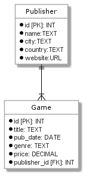
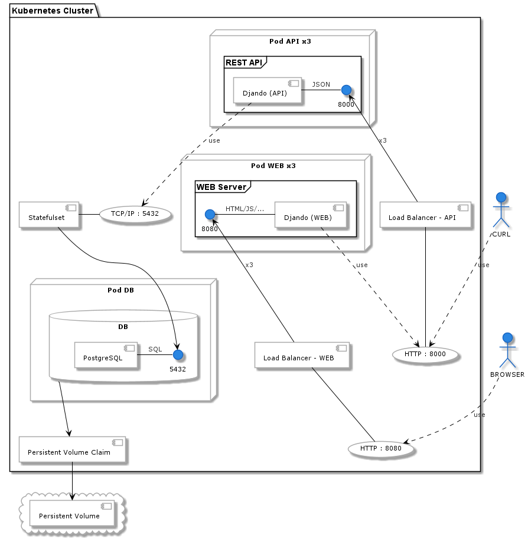

# Projeto final - MES-RS 2020/21

## Grupo - 13

* André Alves — 200257002
* Daniel Tolledo — 200257014
* João Pereira — 190257021

## Descrição do Projeto

O nosso projeto consiste num sistema de registo de publishers e de games. Permite operações de criação, alteração,
remoção e de obtenção sobre a informação. Possuímos uma lista de publishers à qual estão associados games (coleção)
. Podemos ver uma publisher em detalhe com todas as suas informações. Uma lista de games refere-se a uma publisher, e
podemos ver em detalhe, as informações sobre um determinado game.

## Decisões arquiteturais

Este projeto foi desenvolvido com recurso à framework Django (Python). A construção da API foi alcançada com recurso ao
package Django REST-Framework, já a construção da Web foi alcançada com recurso aos Django Templates. Já para a Base de dados
optamos por PostgreSQL.

Foram criadas 3 Docker images, uma para cada aplicação Django (API e Web) e uma para a Base de dados.

Utilizando Kubernetes, fez-se o deployment do sistema com:

* 1 Persistent Volume
* 1 Persistent Volume Claim
* 1 Pod de Base de dados
* 1 Stateful Service para "renomear" o Pod Base de dados
* 3 réplicas do Pod da API REST
* 1 Load Balancer para a API
* 3 réplicas do Pod da aplicação Web
* 1 Load Balancer para a Web

As portas expostas são:

* 8000 - Load Balancer da API
* 8080 - Load Balancer da Web

Para fazer o Deploy:

* Dentro do WSL, é necessário executar:
    * `mkdir /mnt/wsl/data`
    * `sudo mkdir /var/data`
    * `sudo mount --bind /var/data /mnt/wsl/data`
    * `sudo mkdir /mnt/wsl/data/project-pv`

* Depois executar, na PowerShell, o script `kubernetes.ps1`

## API REST

A API construída para obtenção e alteração da informação da base de dados será descrita abaixo.

### End Points

* /publishers/
    * GET
    * POST
* /publishers/\<id>/
    * GET
    * DELETE
* /publishers/\<id>/games/
    * GET
    * POST
    * DELETE
* /publishers/\<id>/games/\<id>/
    * GET
    * PUT
    * DELETE

---

### Obter Lista de Publishers

#### Pedido

`GET /api/publishers/`

    http://localhost:8000/api/publishers/

#### Resposta com Sucesso

```
Status: 200 OK
Content-Type: application/json
Content-Length: 468 bytes
```

```json
[
  {
    "id": 25,
    "name": "Remedy Entertainment",
    "city": "Espoo",
    "country": "Finland",
    "website": "https://505games.com/"
  },
  {
    "id": 26,
    "name": "Rockstar Games",
    "city": "New York",
    "country": "United States",
    "website": "https://www.rockstargames.com/"
  },
  ...
]
```

---

### Criar novo Publisher

#### Pedido

`POST /api/publishers/`

    http://localhost:8000/api/publishers/

```json
{
  "id": 0,
  "name": "Capcom",
  "city": "Osaka",
  "country": "Japan",
  "website": "https://www.capcom.com/",
  "games": [
    {
      "id": 0,
      "title": "Resident Evil Village",
      "pub_date": "18-04-2021",
      "genre": "Survival Horror",
      "price": "59.99"
    },
    {
      "id": 0,
      "title": "Devil May Cry 5",
      "pub_date": "08-03-2019",
      "genre": "Action Adventure",
      "price": "24.99"
    },
    ...
  ]
}
```

#### Resposta com sucesso

```
Status: 201 Created
Content-Type: application/json
Content-Length: 315 bytes
```

```json
{
  "id": 29,
  "name": "Capcom",
  "city": "Osaka",
  "country": "Japan",
  "website": "https://www.capcom.com/",
  "games": [
    {
      "id": 27,
      "title": "Resident Evil Village",
      "pub_date": "2021-04-18",
      "genre": "Survival Horror",
      "price": "59.99"
    },
    {
      "id": 28,
      "title": "Devil May Cry 5",
      "pub_date": "2019-03-08",
      "genre": "Action Adventure",
      "price": "24.99"
    },
    ...
  ]
}
```

#### Resposta(s) com Erros

```
Status: 400 Bad Request
Content-Type: application/json
Content-Length: 187 bytes
```

---

### Obter a informação de um Publisher

#### Pedido

`GET /api/publishers/<int:pk>/`

    http://localhost:8000/api/publishers/29/

#### Resposta com sucesso

```
Status: 200 OK
Content-Type: application/json
Content-Length: 310 bytes
```

```json
{
  "id": 29,
  "name": "Capcom",
  "city": "Osaka",
  "country": "Japan",
  "website": "https://www.capcom.com/",
  "games": [
    {
      "id": 27,
      "title": "Resident Evil Village",
      "pub_date": "2021-04-18",
      "genre": "Survival Horror",
      "price": "59.99"
    },
    {
      "id": 28,
      "title": "Devil May Cry 5",
      "pub_date": "2019-03-08",
      "genre": "Action Adventure",
      "price": "24.99"
    },
    ...
  ]
}
```

---

### Obter a Collection de Games de um Publisher

#### Pedido

`GET /api/publishers/<int:pk>/games/`

    http://localhost:8000/api/publishers/29/games/

#### Resposta com sucesso

```
Status: 200 OK
Content-Type: application/json
Content-Length: 193 bytes
```

```json
[
  {
    "id": 15,
    "title": "Control",
    "pub_date": "2019-08-27",
    "genre": "Action-Adventure",
    "price": "39.99"
  },
  {
    "id": 16,
    "title": "Alan Wake",
    "pub_date": "2010-05-14",
    "genre": "Action-Adventure",
    "price": "12.49"
  },
  ...
]
```

#### Resposta(s) com Erros

```
Status: 404 Not Found
Content-Type: application/json
Content-Length: 29 bytes
```

---

### Criar novo Game para um Publisher

#### Pedido

`POST /api/publishers/<int:pk>/games/`

    http://localhost:8000/api/publishers/29/games/ 

```json
{
  "id": 0,
  "title": "Monster Hunter: World",
  "pub_date": "2018-01-19",
  "genre": "Action",
  "price": "29.99"
}
```

#### Resposta com Sucesso

```
Status: 201 Created
Content-Type: application/json
Content-Length: 219 bytes
```

```json
{
  "id": 29,
  "title": "Monster Hunter: World",
  "pub_date": "2018-01-19",
  "genre": "Action",
  "price": "29.99",
  "publisher": {
    "id": 25,
    "name": "Remedy Entertainment",
    "city": "Espoo",
    "country": "Finland",
    "website": "https://505games.com/"
  }
}
```

#### Resposta(s) com Erros

```
Status: 400 Bad Request
Content-Type: application/json
Content-Length: 87 bytes
```

```
Status: 404 Not Found
Content-Type: application/json
Content-Length: 29 bytes
```

---

### Eliminar uma Game Collection de um Publisher

#### Pedido

`DELETE /api/publishers/<int:pk>/games/`

    http://localhost:8000/api/publishers/29/games/ 

#### Resposta com Sucesso

```
Status: 200 OK
Content-Type: application/json
Content-Length: 2 bytes
```

```json
{}
```

#### Resposta(s) com Erros

```
Status: 404 Not Found
Content-Type: application/json
Content-Length: 29 bytes
```

---

### Obter a informação de um Game

#### Pedido

`GET /api/publishers/<int:pk>/games/<int:pk>/`

    http://localhost:8000/api/publishers/25/games/16/

#### Resposta com Sucesso

```
Status: 200 OK
Content-Type: application/json
Content-Length: 217 bytes
```

```json
{
  "id": 16,
  "title": "Alan Wake",
  "pub_date": "2010-05-14",
  "genre": "Action-Adventure",
  "price": "12.49",
  "publisher": {
    "id": 25,
    "name": "Remedy Entertainment",
    "city": "Espoo",
    "country": "Finland",
    "website": "https://505games.com/"
  }
}
```

#### Resposta(s) com Erros

```
Status: 404 Not Found
Content-Type: application/json
Content-Length: 29 bytes
```

---

### Alterar um Game

#### Pedido

`PUT /api/publishers/<int:pk>/games/<int:pk>/`

    http://localhost:8000/api/publishers/25/games/16/

```json
{
  "id": 16,
  "title": "Alan Wake",
  "pub_date": "2010-05-14",
  "genre": "Action Horror",
  "price": "12.49"
}
```

#### Resposta com Sucesso

```
Status: 200 OK
Content-Type: application/json
Content-Length: 214 bytes
```

```json
{
  "id": 16,
  "title": "Alan Wake",
  "pub_date": "2010-05-14",
  "genre": "Action Horror",
  "price": "12.49",
  "publisher": {
    "id": 25,
    "name": "Remedy Entertainment",
    "city": "Espoo",
    "country": "Finland",
    "website": "https://505games.com/"
  }
}
```

#### Resposta(s) com Erros

```
Status: 400 Bad Request
Content-Type: application/json
Content-Length: 87 bytes
```

---

### Eliminar um Game

#### Pedido

`DELETE /api/publishers/<int:pk>/games/<int:pk>/`

    http://localhost:8000/api/publishers/25/games/16/

#### Resposta com Sucesso

```
Status: 200 OK
Content-Type: application/json
Content-Length: 2 bytes
```

```json
  {}
```

#### Resposta(s) com Erros

```
Status: 404 Not Found
Content-Type: application/json
Content-Length: 29 bytes
```

---

## Diagramas

### Modelo de Dados



### Kubernetes

